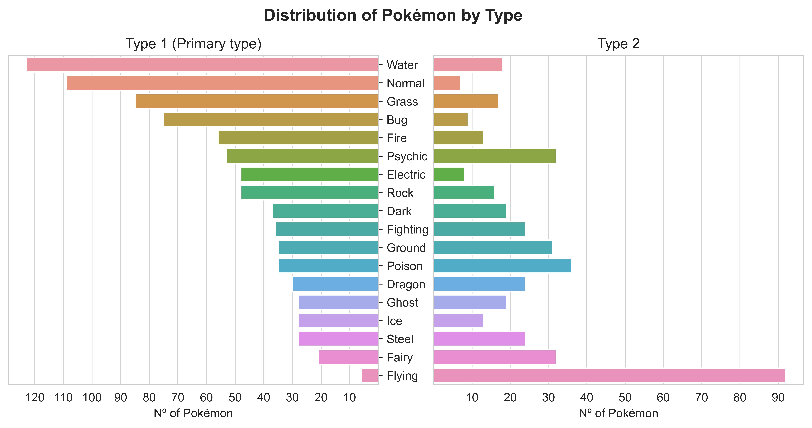
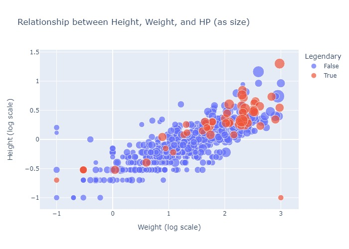

# Ironhack Project-2
---


--- 
# 1- Main objective

To enrich a Pokémon dataset obtained from [Kaggle](https://www.kaggle.com/datasets/abcsds/pokemon):


- As of today, the Pokémon games consist of **8 generations**, adding up a total of **#905** creatures. Thus, this dataset is outdated. 
- In addition, it is missing some **categories** that would make for an interesting investigation. 

---
# 2- Enriching the dataset
## 2.1- Using the [Poke API](https://pokeapi.co/)
Defined a function to fetch the **missing pokémon** iterating over the url using the pokémon #ID:

```python
def fetchMissing(a, b):
    '''This functions receives two pokemon id numbers as integers ('a' and 'b'),
    and returns a dataframe containing the specified pokemon from the ids 'a' to 'b'.
    '''
    missing_pokes = []
    for i in range(a,b+1):
        time.sleep(1)
        print(f"Fetching pokemon with id: {i}")
        response_api = requests.get(f"https://pokeapi.co/api/v2/pokemon/{i}/").json()
        missing_pokes.append(response_api)
    
    return json_normalize(missing_pokes)
```
The request returned loads of information, but it needed to be **extracted** and cleaned. Luckily enough, weight and height were already clean, I just needed to transform the units.


Since they all followed the same format, I could use indexing and split methods to extract the **stats**:

```python
def extractStats(df):
    '''This function receives a dataframe and extracts the HP, Attack, Defense, Sp. Atk, Sp. Def, and Speed from 'stats'.
    It returns a df with the extracted values of each stat for each pokemon in new columns.
    '''
    HP = []
    Attack = []
    Defense = []
    Sp_Atk = []
    Sp_Def = []
    Speed = []
    
    for i in range(len(df)):
        HP.append(int("".join([x for x in missing_pokes.iloc[i]['stats'].split(",")[0] if x.isdigit()])))
        Attack.append(int("".join([x for x in missing_pokes.iloc[i]['stats'].split(",")[4] if x.isdigit()])))
        Defense.append(int("".join([x for x in missing_pokes.iloc[i]['stats'].split(",")[8] if x.isdigit()])))
        Sp_Atk.append(int("".join([x for x in missing_pokes.iloc[i]['stats'].split(",")[12] if x.isdigit()])))
        Sp_Def.append(int("".join([x for x in missing_pokes.iloc[i]['stats'].split(",")[16] if x.isdigit()])))
        Speed.append(int("".join([x for x in missing_pokes.iloc[i]['stats'].split(",")[20] if x.isdigit()])))
    
    df['HP'] = HP
    df['Attack'] = Attack
    df['Defense'] = Defense
    df['Sp. Atk'] = Sp_Atk
    df['Sp. Def'] = Sp_Def
    df['Speed'] = Speed
    
    return df
```

Once extracted, I added some categorical columns that were missing in the request:

- **Total score, based on the other stats:**

```python
def calculateTotal(df):
'''This function receives a dataframe and calculates the Total score of a pokemon
based on the sum of its stats (Hp, Attack, Defense, Sp. Atk, Sp. Def, Speed).
It returns the dataframe with the Total column.
'''
df['Total'] = df['Hp'] + df['Attack'] + df['Defense'] + df['Sp. Atk'] + df['Sp. Def'] + df['Speed']
return df
```

- **Generation to which they belong, based on ID#:**
```python
def setGeneration(df):
'''This function receives a dataframe and returns the generation to which the pokemon belongs based on its ID.
'''
generation_7 = [n for n in range(722,810)]
generation_8 = [n for n in range(810,905)]

df['Generation'] = df['Id'].apply(lambda x: 7 if x in generation_7 else 8)

return df
```

- **Legendary status, based on ID#:**
```python
def setLegendary(df):
'''This function receives a dataframe and returns the legendary status (True/False) of a pokemon based on its ID.
'''
gen_7_legendaries = [772,773,785,786,787,788,789,790,791,792,793,800] 
gen_8_legendaries = [888,889,890,891,892,894,895,896,897,898,905]
legendaries = gen_7_legendaries + gen_8_legendaries

df['Legendary'] = df['Id'].apply(lambda x: True if x in legendaries else False)

return df
```

Ended up with a much **cleaner** version of the dataframe:


## 2.2- Using Web scraping from the wiki

From the Pokémon wiki ([WikiDex](https://www.wikidex.net/wiki/WikiDex)) I extracted the pokémon **Types** for the missing Pokémon (#722 to #905), as well as the **Height, Weight** and **Catch rate** for the pokémon I already had in the dataset from Kaggle:

- **Types:**


To fetch the **types** I selected the first paragraph, and `split` by `"typo "` since all descriptions followed the same format. First I checked it worked for one:


And then I defined a function to **iterate** over the url using the name of the pokémon:

```python
def getType(list_of_pokes):
    '''This functions appends the Type of each pokemon to a list.
    If the pokemon is not found in the wiki, it appends "NaN" instead.
    '''
    types_list = []
    
    for i in range(len(list_of_pokes)):
        pokemon_url = f"https://www.wikidex.net/wiki/{list_of_pokes[i]}"
        response = requests.get(pokemon_url)
        html = response.content
        soup = BeautifulSoup(html, "html.parser")
        types = soup.find("p")
        try:
            types_list.append(types.getText().split("tipo ")[1].split(" ")[0])
        except IndexError:
            types_list.append('NaN')
        
    return types_list
```
Then I split the column types in two, to get *Type 1* and *Type 2*.

- **Height and Weight:**


To fetch both categories I used the data from a table, tagged the `tr` with their respectrive `attrs` and cleaned it by getting the text, splitting and indexing. I checked it worked for one:


And then I defined a function to **iterate** over the url using the name of the pokémon, again:

```python
def getWeight(list_of_pokes):
    '''This functions appends the weight of each pokemon to a list.
    If the pokemon is not found in the wiki, it appends "NaN" instead.
    '''
    weight_list = []
    
    for i in range(len(list_of_pokes)):
        pokemon_url = f"https://www.wikidex.net/wiki/{list_of_pokes[i]}"
        response = requests.get(pokemon_url)
        html = response.content
        soup = BeautifulSoup(html, "html.parser")
        weight = soup.find_all("tr", attrs = {"title" : "Peso del Pokémon"})
        
        try:
            weight_float = float(weight[0].getText().strip().split('\n')[-1].split(" ")[0].replace(",","."))
            weight_list.append(weight_float)
        except IndexError:
            weight_list.append('NaN')
        
    return weight_list
```
- **Catch rate:**


Followed the same procedure as before, in this case the tag was `ul` and I used RegEx to extract the **digit** fraction after splitting by *Ratio de captura*.


Defined a function to **iterate** over the url:

```python
def getCatchrate(list_of_pokes):
    '''This functions appends the Catch rate of each pokemon to a list.
    If the pokemon is not found in the wiki, it appends "NaN" instead.
    '''
    catch_list = []
    
    for i in range(len(list_of_pokes)):
        pokemon_url = f"https://www.wikidex.net/wiki/{list_of_pokes[i]}"
        response = requests.get(pokemon_url)
        html = response.content
        soup = BeautifulSoup(html, "html.parser")
        catch = soup.find_all("ul")
        try:
            catch_list.append(int(re.search(r'\d+', str(catch).split("Ratio de captura</a>: ")[1]).group()))
        except IndexError:
            catch_list.append('NaN')
        
    return catch_list
```

After that I reorganized the two datasets so that the columns matched and I **concatenated** them. Ended up with a clean **pokedex:**


---

# 3- Visualization

#### 3.1- When did the franchise stop trying anymore?
- Apparently from Generation 6:


#### 3.2- Which Pokémon type do developers prefer?
- Water types are the most prevalent pokémon.
- Type 1 and Type 2 follow an opposite distribution.




<br/>

#### 3.3- Which Pokémon type should you include in your team?
- Based on total score, you should definitely go for **dragon** types.
- Overall, the developers did a good job **balancing** the different types.


#### 3.4- Is there a correlation between stats?

- The taller, the heavier. There are exceptions, though.
- The more powerful the pokemon, the more difficult to catch.
- Legendaries are also more difficult to catch.


##### 3.4.1- Catch rate vs. Power vs. Speed
- Cathch rate is inversely proportional to power.
- Legendaries are the most powerful and difficult to catch.

[Interactive version!](images/catchrate_total_speed.html)
<br/>

##### 3.4.3- Height vs. Weight vs. Catch rate
- Apparently the smaller the pokemon, the more easy it is to catch it.

[Interactive version!](images/speed_weight_HP.html)
<br/>

##### 3.4.2- Height vs. Weight vs. HP
- Height and weight show a positive correlation.
- The amount of health points (HP) correlates pretty well with the size of the pokémon.

[Interactive version!](images/weight_height_total.html)
<br/>
The particular case of [Cosmoem](https://www.wikidex.net/wiki/Cosmoem): 999,9 kg and 0,1 m. 

<br/>

**Bonus: Pokemon stats make no sense:**

